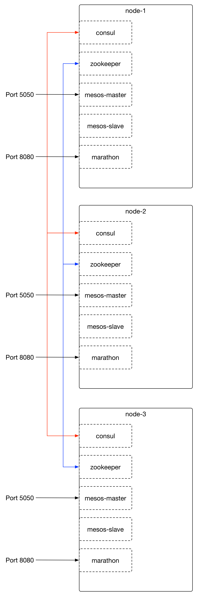

# experiment 11

* 3x hosts (centos 6.x)
* docker + centos 6.x workarounds
* consul server (bootstrap on node-1; join on node-2, node-3)
* zookeeper
* mesos-master (uses zk for leader election)
* mesos-slave
* marathon
* containers with `--net host`, base centos:7
* containerised: consul, zookeeper, mesos-master, mesos-slave, marathon

TODO:

* Update consul services from containers created by mesos
  - synapse?  registrator?  other?

* haproxy on localhost for external services (e.g. localhost:1234 is enterprise ntp server)

## diagram

